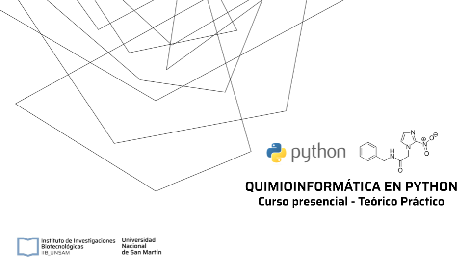

---
tags:
  - requisitos
  - costos
  - inscripción
  - horarios
  - programa
---

<!--
## Correlativas para alumnos de grado UNSAM

* CB14 Estadistica Aplicada
* CB07 Biología Molecular

-->
{ width="850" }

:fontawesome-regular-file-pdf: [Slides Presentación del Curso](https://drive.google.com/file/d/1OI-t43zqHLL8JUUM9VmXg3mgSsnpLerI/view?usp=sharing)

## A quién está orientado
Estudiantes o graduados de Química, Biología, Biotecnología, Bioinformática o carreras afines.

## Requisitos

* Conocimientos de química
* Manejo básico de computadoras.
* Cuenta de Google (gmail)

## Costos

* **Alumnos de Grado UNSAM:** Sin costo. 
* **Alumnos de Post-Grado UNSAM:** Sin costo. 
* **Alumnos de Post-Grado de otras Universidades Públicas:** $30,000
* **Docentes Universidades Nacionales:** $100,000
* **Alumnos de Posgrado Universidades Privadas:** $200,000
* **Empresas/Profesionales Independientes:** $250,000
* **Alumnos / Docentes / Profesionales Internacionales:** USD $300

## Horarios 1er Cuatrimestre 2025 (TBD)

* **Virtual:** TBD
* **Presencial:** TBD

## Asistencia

* **Teóricas y Prácticas:** Asistencia obligatoria al 80% de las clases

## Evaluación

* **Evaluación teórica:**
Trabajo Final Grupal

<!--
* **Promoción:** 
Todas las instancias evaluatorias (teórico + práctico) con puntaje de 7 o más.
* **Examen Final:** En caso de instancias evaluatorias aprobadas con 5, o en caso de tener que recuperar. 
* **Recursa:** En caso de no cumplir con requisito de asistencia o instancias evaluatorias no aprobadas.
  

## Inscripción

Para inscribirte vas a necesitar:

- Si sos alumno UNSAM:
    * [x] Tu número de legajo
- Si sos posgrado, investigador o trabajas en la industria:
    * [x] Breve descripción de tu línea de trabajo
    * [x] Carta de motivación

- Si vas a solicitar beca:

### Cierre de Inscripción

01 de Junio, 2023

### Notificación de Aceptación

Los cupos para estudiantes de posgrado, investigadores y trabajadores de la industria son limitados.

Aquellas personas que sean aceptadas para el curso serán notficadas el 06 de Junio, 2023

[Inscribirse](https://forms.gle/bsm4kCkggLhEvutB8){ .md-button .md-button--primary }
-->