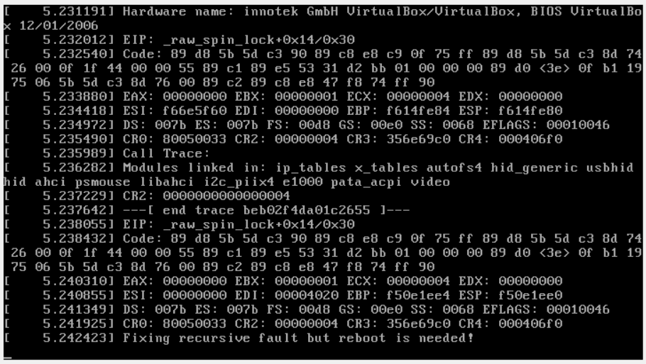
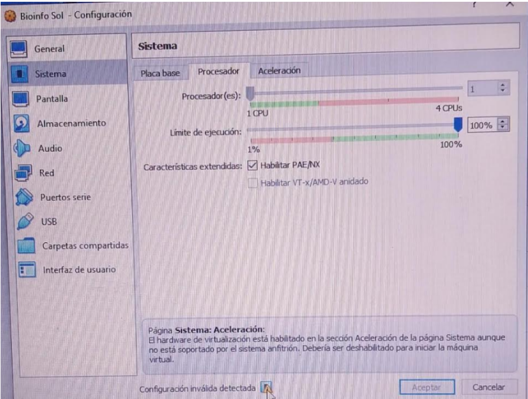
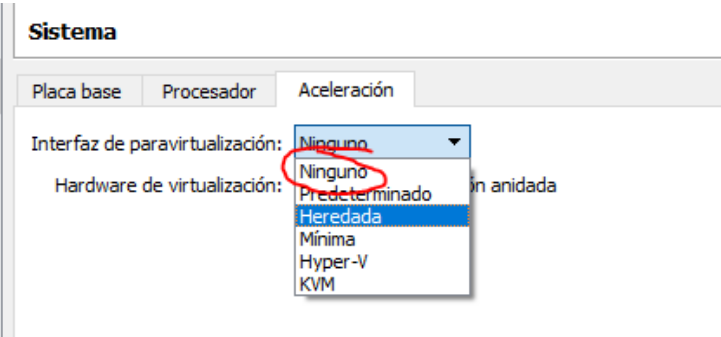
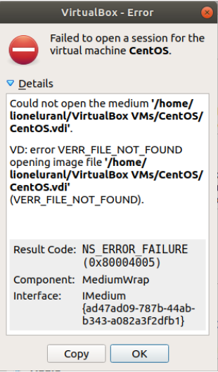

# Problemas y posibles soluciones

## No funciona y eligieron la virtualización de 32 bits (es la única que se está ofreciendo)

!!! info "Solución:"

    * Habilitar una opción de virtualización especial (`PAN/NX`), sobre todo en sistemas nuevos.

    * Para hacerlo: 

        Click derecho en la máquina virtual --> *Configuración* --> *Sistema* --> *Procesador* --> *Habilitar PAE/NX*

    * *Habilitar PAE/NX* tiene que estar con el tick

## Sigue sin funcionar

* *Habilitar PAE/NX* está tildado y la máquina virtual se queda congelada en una pantalla similar a la siguiente:

{ width="400", align=center }

!!! info "Solución:"

    * Click derecho en la máquina virtual --> *Configuración* --> *Sistema* --> *Procesador*

    * Prueben con 2 o 4 procesadores en la barra que dice Procesador(es), siempre manejándose dentro del rango verde.

## Mensaje de Error: "This computer does not have hardware-assisted virtualization"

* La computadora, por defecto, no permite la virtualización.

!!! info "Solución:"

    * Sigan los pasos descritos en [este post](https://www.makeuseof.com/tag/virtualization-issues-simple-solutions/).

## En sistema aparece cartel que dice: *el hardware de virtualización está habilitado en la sección de aceleración de la página de Sistema...*

{ width="400", align=center }

!!! info "Solución:"

    * Accedan a la pestaña de `Aceleración` y asegúrense de que no haya ninguna interfaz de paravirtualización seleccionada.

    { width="400", align=center }


## Error: "Could not open medium"

{ width="200", align=center }

* Es posible que hayan movido el archivo vmdk.

!!! info "Solución:"

    * Vayan a:

        *Archivo* --> *Biblioteca de Medios (Virtual media manager)* y remuevan el disco problemático.

    * Si la opción de remover les aparece deshabilitada, deberán “Liberarlo” primero. Luego, borren la máquina virtual y vuélvanla a crear usando la nueva (y **definitiva**) ubicación del archivo vmdk.


## Error: Kernel driver not installed (rc=-1908)

!!! info "Solución para máquina física/host con sistema operativo Ubuntu:"

    * Abrir la terminal y correr los siguientes comandos:

        ```Bash
        sudo dpkg-reconfigure virtualbox-dkms
        sudo /sbin/vboxconfig
        ```

    * Luego de esto, abrir nuevamente VirtualBox e iniciar la maquina virtual. El error se debería haber solucionado.
