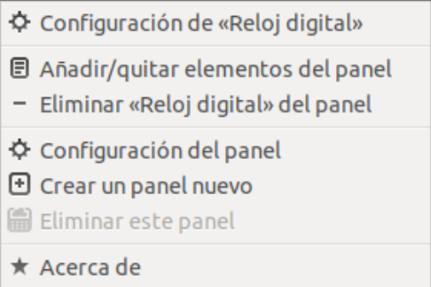
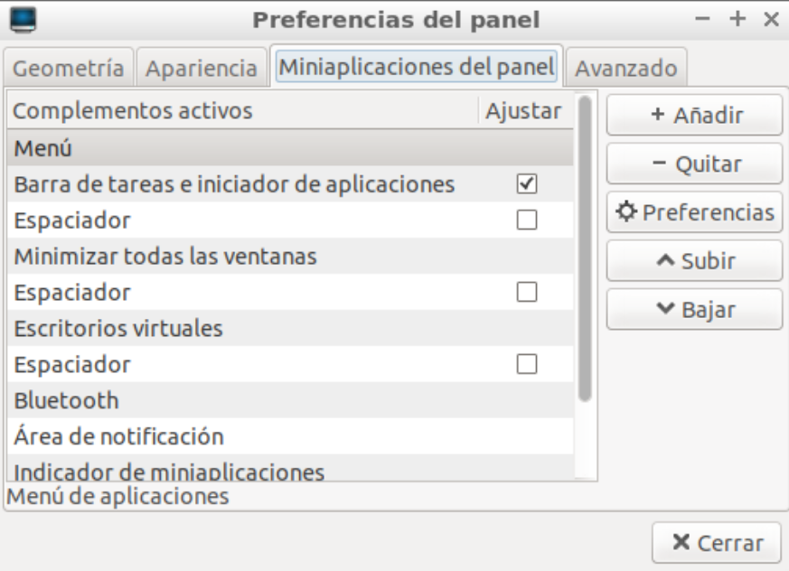
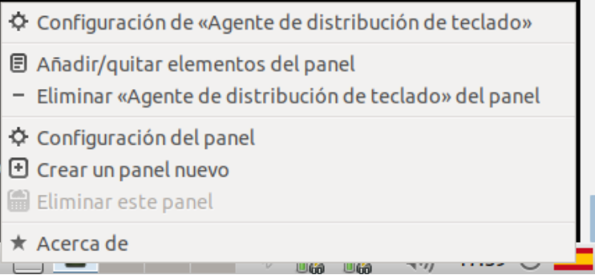
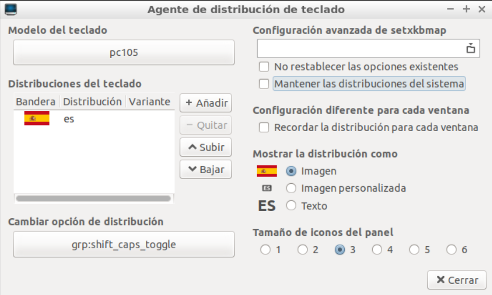
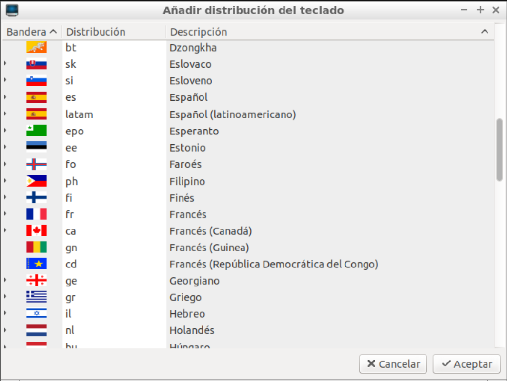
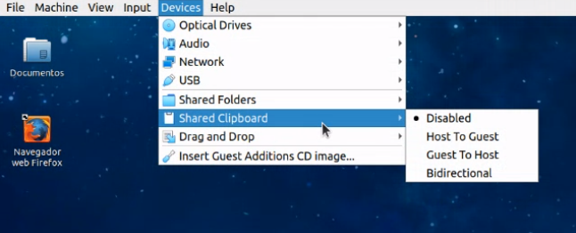
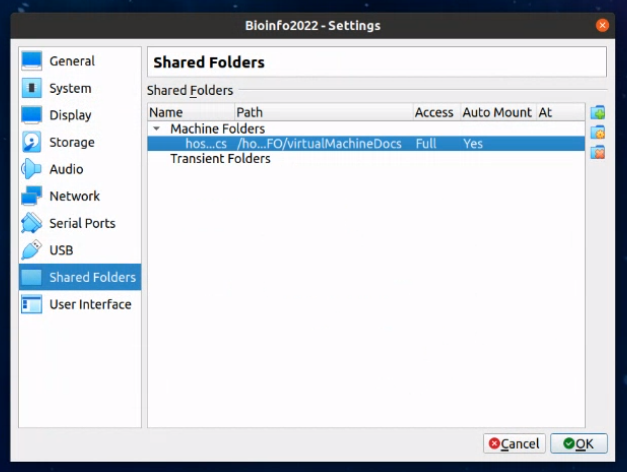
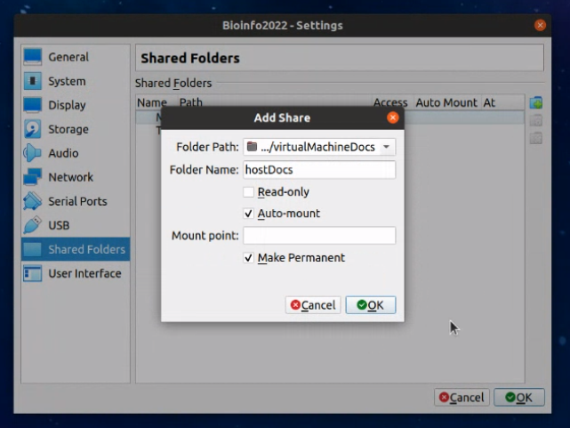
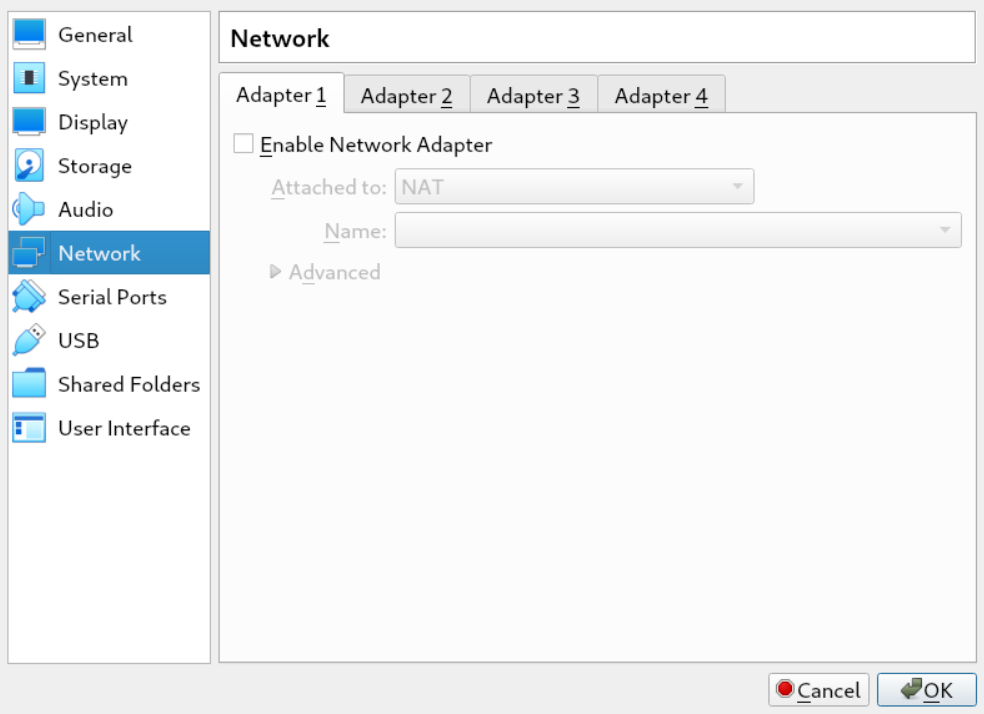
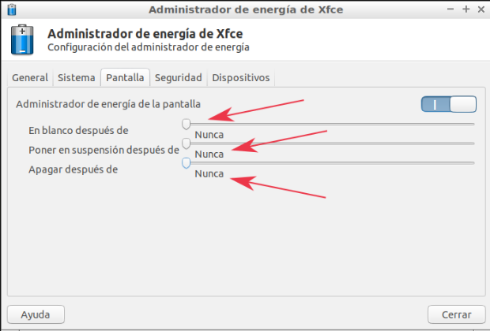

## Maximizar la ventana

Si maximizamos la ventana a *pantalla completa*, será como estar usando la máquina virtual solamente. Esto para algunos puede resultar más cómodo. Pueden probarlo presionando las teclas ++ctrl++ **derecho** + ++f++ juntas. Con volver a presionar esas teclas salen de la *pantalla completa*.

{ width="400", align=center }

## Acceso a la línea de comandos
Para acceder a la línea de comandos hay varias formas:

* **Forma 1:** *Inicio* :material-arrow-right: *Herramientas del sistema* :material-arrow-right: *LXTerminal*
* **Forma 2:** Presionar las teclas ++ctrl++ + ++alt++ + ++t++, las tres juntas. ++ctrl++ y ++alt++ tienen que ser los de la izquierda.
* **Forma 3:** Presionando la tecla ++f4++ en la carpeta donde nos encontremos.

## Cambiar el layout del teclado

Para cambiar el layout del teclado (en que tecla está el @, el |, los paréntesis, etc):

1. Click derecho en el panel:

    { width="400", align=center }

2. Seleccionar *Añadir/quitar elementos del panel*

    { width="200", align=center }

3. Seleccionar *Añadir* :material-arrow-right:
 *Agente de distribución del teclado*

    { width="400", align=center }

4. Hacer click en *Añadir* y cerrar la ventana.

    En el panel aparecerá al lado del botón de apagado la bandera española, click derecho sobre la bandera y seleccionar la primera opción: Configuración de **Agente de distribución de teclado**

    { width="400", align=center }

5. Se abrirá una ventana. Destildar la opción: *Mantener las distribuciones del sistema* y se habilitarán las opciones:

    { width="400", align=center }

6. En Distribuciones del teclado elegir Añadir y busca en la lista el teclado correspondiente.

    Los más comunes son:

    * Español (es)
    * Español latinoamericano (latam)
    * Inglés (EE.UU.) (us)

    **Si no sabés cual es:** podés chequear algunos teclados en [Wiki](https://es.wikipedia.org/wiki/Distribuci%C3%B3n_del_teclado) en la sección QUERTY.

7. Selecciona el que corresponda y haz click en Aceptar. Volverá a la ventana anterior donde puedes subir la configuración que desees usar (o quitar la que no quieres usar).

    { width="400", align=center }

**8.** Si dejaste más de una configuración, haciendo click sobre la banderita en el panel podés cambiar a las distintas configuraciones (va cambiando la etiqueta).

## Copiar y pegar de máquina host a máquina virtual y viceversa

Para copiar y pegar de la máquina host (es decir, sus **compus físicas**) a la máquina virtual (la de la materia) tienen que:

1. Con la máquina virtual abierta
2. Van a *Devices*/*Dispositivos* :material-arrow-right: *Shared Clipboard*/*Portapapeles Compartido* y seleccionan *Bidirectional*/*Bidireccional*

    { width="400", align=center }


## Compartir una carpeta con la máquina host

Una manera simple de compartir archivos entre la máquina *host* (es decir, sus **compus físicas**) y la máquina virtual o viceversa es crear una carpeta compartida, para esto:

1. Con la máquina virtual abierta
2. Van a *Devices*/*Dispositivos* :material-arrow-right: *Shared Folder*/*Carpetas Compartidas* y seleccionan *Shared Folders Settings*/*Preferencias de carpetas compartidas*.

    Se les abrirá una ventana, donde deben elegir la carpetita con el símbolo más que está a la derecha para agregar una carpeta compartida y se les abrirá una nueva ventana.

    { width="400", align=center }

    * **Folder Path:** Indican la ruta a la carpeta que van a compartir en la máquina *host* (SU computadora).
    * **Folder Name:** El nombre con el que aparecerá la carpeta en la máquina virtual
    * **Auto-mount:** Tiene que estar tickeado.
    * **Make Permanent:** Tiene que estar tickeado.

3. Click en Ok.

4. Deberían ver algo similar a lo siguiente:

    { width="400", align=center }

5. Click en Ok.

6. Se les debe haber creado un ícono en el escritorio de la máquina virtual con el nombre que eligieron en **Folder Name**

7. Si hacen click, deberían poder acceder a la carpeta. Si aparece un cartel donde dice que no tienen los permisos necesarios, entonces hacen lo siguiente.

    1. Abren una terminal utilizando las teclas: ++ctrl++ + ++alt++ + ++t++
    2. Escriben lo siguiente en la terminal:

        ``` bash
        sudo usermod -a -G vboxsf $(whoami)
        ```
        
        Si les pide una clave es **unsam**

## Acceso a Internet

Es necesario que la máquina virtual tenga acceso a internet. Puede ser que esto funcione automaticamente, pero de no ser así pueden hacer:

1. Van a *Settings*/*Configuración* :material-arrow-right:
 *Network*/*Red* 

2. Habilitan en la pestaña *Adapter 1* la opción **Enable Network Adapter**

    { width="400", align=center }

**Enable Network Adapter** tiene que estar tildado.

## Resolución de Pantalla
Por defecto, la pantalla de la máquina virtual debería agrandarse según el tamaño de su monitor. Si esto no sucede pueden agrandar la pantalla a mano haciendo:

1. Click en el Botón **inicio** de Lubuntu  (esquina inferior izquierda)

2. Click en **Preferencias**

3. Click en **Ajustes del monitor**

    { width="400", align=center }

4. Pasar la resolución a la mayor posible (podemos usar la misma que usamos en el sistema operativo del host)

    { width="400", align=center }

5. Click en **Aplicar** y, si estamos conformes, en **Guardar**.

6. Para que la resolución de pantalla elegida sea permanente:

    Esta versión de lubuntu presenta un bug donde la resolución cambia cada vez que se suspende la VM. Por lo tanto la forma más sencilla de solucionarlo es configurando la VM para no suspenderse más:

    1. Click en el Botón **inicio** de Lubuntu  (esquina inferior izquierda)
    2. Click en **Preferencias**
    3. Click en **Administrador de energía**
    4. Click en la pestaña Pantalla y luego mover las tres barras hasta la izquierda como se muestra en la siguiente imagen:

        { width="400", align=center }

    5. Click en la pestaña Seguridad y luego seleccionar "Nunca" en la lista desplegable que aparece al lado de **Bloquear sesión automáticamente** y luego destildar donde dice "Bloquear la pantalla cuando el sistema vaya a suspensión". Tiene que quedar como se ve en la siguiente imagen:

        { width="400", align=center }