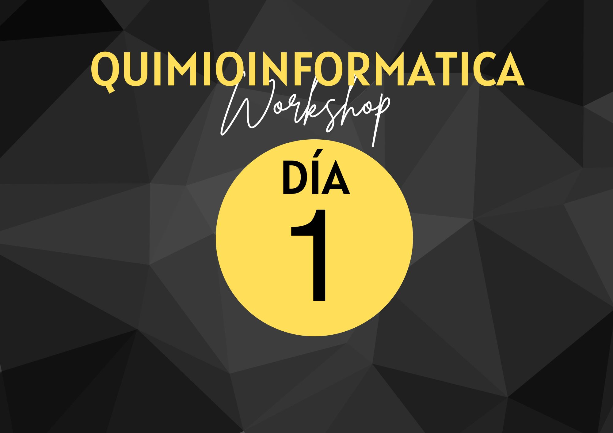

{ width="250", align="left" }

# **TP 0**. Introducción a Google Colaboratory + Python { markdown data-toc-label = 'TP 0' }

<!--
[:fontawesome-solid-download: Materiales](https://drive.google.com/file/d/19WCbTgcwuJoK4pSrt-BpUM2INV4FZCRG/view?usp=sharing){ .md-button .md-button--primary }
Este es el botón para decargar materiales, en (#) hay que agregar el link correspondiente
--->
