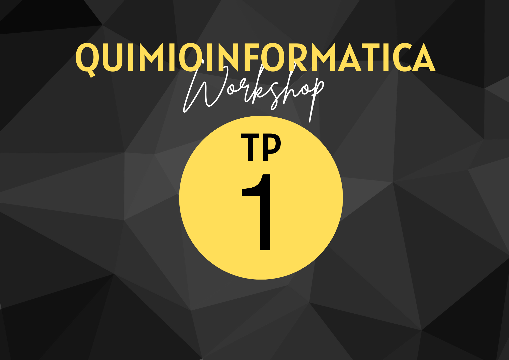

{ width="250", align="left" }

# **TP 2**. Introducción a Bases de Datos y Softwares Quimioinformáticos'

[:fontawesome-solid-download: Materiales](https://colab.research.google.com/drive/1g-QhAABDzJpFO4Gqbp6Fssc6Q6LMV-bq?usp=drive_link){ .md-button .md-button--primary }

<!--
Este es el botón para decargar materiales, en (#) hay que agregar el link correspondiente
--->

* Slides [:fontawesome-solid-download: PDF](https://drive.google.com/file/d/1HUecyMWHsp-GdO0NyMj4XEfHK6pgwj2x/view?usp=sharing)

# 
En este práctico vamos a ver las bases de datos más usadas que almacenan datos de compuestos químicos con sus bioactividades y los softwares que se pueden usar para analizar los datos disponibles 

## Bases de Datos Quimioinformáticas

Las bases de datos quimioinformáticas son repositorios de información estructurada que contienen datos químicos y bioquímicos. Estas bases de datos están diseñadas específicamente para almacenar, organizar y proporcionar acceso a una amplia gama de datos relacionados con compuestos químicos, moléculas y propiedades asociadas.

Estas bases de datos quimioinformáticas son una fuente valiosa de información para la investigación y el desarrollo en química medicinal, descubrimiento de fármacos, diseño de compuestos, síntesis química, análisis de estructuras moleculares y otras áreas relacionadas. Ayudan a acelerar el proceso de descubrimiento y desarrollo de nuevos compuestos químicos y a fomentar la colaboración y el intercambio de conocimientos en la comunidad científica.

## Softwares Quimioinformáticos

Los softwares quimioinformáticos son programas informáticos diseñados específicamente para el análisis y procesamiento de datos químicos y bioquímicos. Estos programas combinan principios de la química y la informática para abordar problemas relacionados con la caracterización, modelado y análisis de sustancias químicas.
