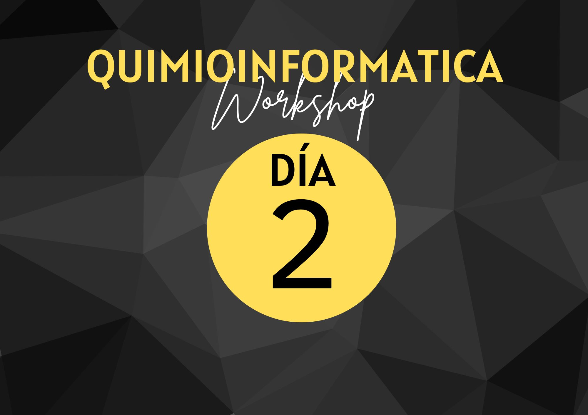

{ width="250", align="left" }

# **TP 2**. Trabajando con una lista de compuestos  { markdown data-toc-label='TP 2' }

[:fontawesome-solid-download: Materiales](https://drive.google.com/file/d/1ujXCxAVQ1xKmk-nCYX1HqF6uaZNUbIet/view?usp=sharing){ .md-button .md-button--primary }
<!--
Este es el botón para decargar materiales, en (#) hay que agregar el link correspondiente.
-->

