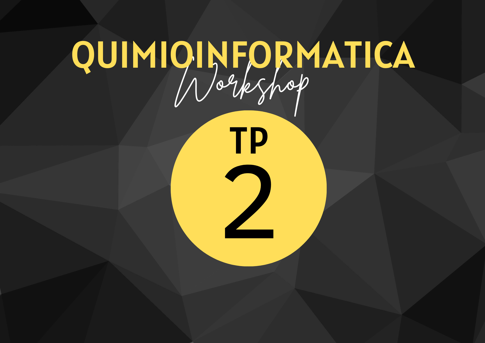

{ width="250", align="left" }

# **TP 3**. Trabajando con una lista de compuestos  { markdown data-toc-label='TP 2' }

[:fontawesome-solid-download: Materiales](https://drive.google.com/file/d/128SkGbPPi1Wy-73i5-dJ5DKYOvogem4g/view?usp=sharing){ .md-button .md-button--primary }
<!--
Este es el botón para decargar materiales, en (#) hay que agregar el link correspondiente.
-->

* Datos [:fontawesome-solid-download: PDF](https://drive.google.com/file/d/1k1u0gx8DeH7XMSwzPbaxOeAGcvFlD8Ss/view?usp=sharing)

#

La obtención de datos quimioinformáticos y el análisis a gran escala son dos áreas fundamentales que han transformado la investigación química y farmacéutica. Al aprovechar la enorme cantidad de datos disponibles y aplicar técnicas de análisis avanzadas, podemos obtener información valiosa para acelerar el descubrimiento de nuevos medicamentos y mejorar nuestra comprensión de los compuestos químicos.

A lo largo de este práctico vamos a estar trabajando con los comandos básicos de RDKit y de Pandas para trabajar con una lista de moléculas. Las listas de moléculas las vamos a obtener de diferentes bases de datos.

## Obtención de datos Quimioinformáticos

La obtención de datos quimioinformáticos ha generado un impacto significativo en el campo de la química y la investigación farmacéutica en las últimas décadas. Gracias al avance de la tecnología y la informática, ahora podemos recopilar, almacenar y analizar grandes volúmenes de información relacionada con compuestos químicos y sus propiedades. Estos datos, provenientes de diversas fuentes y métodos, proporcionan una sólida base para la investigación y el desarrollo de nuevos medicamentos, así como para profundizar en nuestra comprensión de la estructura y función de las moléculas.

## Análisis de datos Quimioinformáticos

El análisis de datos quimioinformáticos a gran escala implica el procesamiento y la interpretación de vastas cantidades de información relacionada con moléculas, compuestos químicos y las propiedades asociadas a ellos. Estos datos pueden provenir de diversas fuentes, como bases de datos públicas, experimentos de alto rendimiento y simulaciones computacionales. Además, los datos pueden incluir información detallada sobre estructuras moleculares, propiedades físico-químicas, actividades biológicas y relaciones estructura-actividad, entre otros.

El análisis de datos a gran escala en el ámbito quimioinformático también puede revelar relaciones y conexiones que no serían evidentes a simple vista, lo que abre puertas a nuevos hallazgos científicos y avances en el diseño de fármacos.