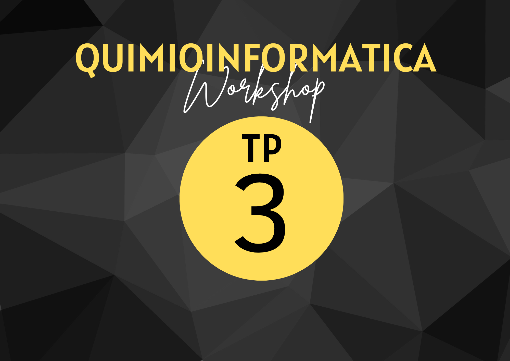

{ width="250", align="left"}

# **TP 3**. Caracterización fisicoquímica { markdown data-toc-label = 'TP 3' }

[:fontawesome-solid-download: Materiales](https://drive.google.com/file/d/1EY_H0N262KwXXhEJQwc_ejARw5o_kVO1/view?usp=sharing){ .md-button .md-button--primary }

<!--
Este es el botón para decargar materiales, en (#) hay que agregar el link correspondiente.
-->

* Datos [:fontawesome-solid-download: .csv](https://drive.google.com/file/d/1x-tgkBqvDYFvQdd1PsCghT9Umtyo76F_/view?usp=drive_link)

## Obtención parámetros fisicoquímicos

La quimioinformática utiliza métodos computacionales para calcular y predecir propiedades fisicoquímicas a partir de la estructura química de un compuesto. Esto permite ahorrar tiempo y recursos al proporcionar estimaciones rápidas y confiables de estas propiedades sin necesidad de síntesis o experimentos costosos. Además, la quimioinformática es especialmente valiosa cuando se trabaja con grandes bases de datos de compuestos, donde la realización de experimentos para cada compuesto sería prácticamente imposible.

La utilidad del cálculo de propiedades fisicoquímicas mediante la quimioinformática abarca diferentes campos. En el diseño de fármacos, por ejemplo, la predicción de propiedades como la solubilidad, la lipofilicidad y la actividad biológica permite identificar compuestos prometedores con características deseadas, reduciendo así el número de compuestos a sintetizar y evaluar experimentalmente.