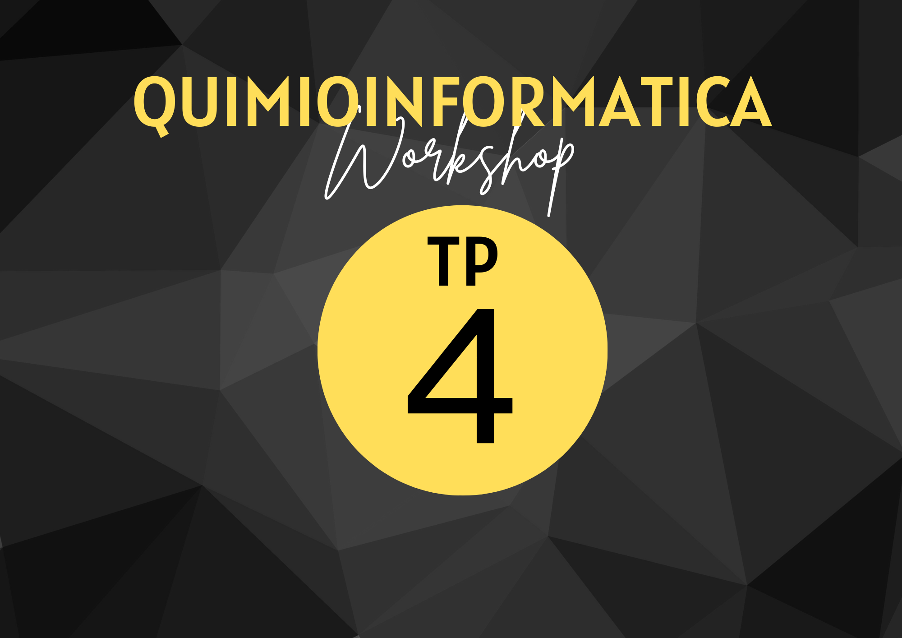

{ width="200", align="left" }

# **TP 4**
# Similitud de compuestos y clusterización { markdown data-toc-label = 'TP 4' }

<!--
[:fontawesome-solid-download: Colab Notebook](material/Trabajo_Practico_2.ipynb){ .md-button .md-button--primary }
[:fontawesome-solid-link: Colab Notebook](https://drive.google.com/file/d/1SVMusirk8cYajEPHiXSfkXwV9T0gNRjY/view?usp=sharing){ .md-button .md-button--primary }

* Datos [:fontawesome-solid-download: .csv](material/smiles.csv)
* Slides [:fontawesome-solid-download: PDF](material/TP2.pdf)
-->

* Paper [:fontawesome-solid-download: PDF](material/Safizadeh(2021).pdf)

## Similitud de compuestos y clusterización por fingerprints y PCA

En el campo de la quimioinformática, la clusterización basada en fingerprints y el análisis de componentes principales (PCA) son dos enfoques ampliamente utilizados para explorar y analizar conjuntos de datos de compuestos químicos. Estas técnicas proporcionan herramientas poderosas para descubrir agrupamientos y patrones, lo que facilita la identificación de nuevas moléculas prometedoras en el descubrimiento de fármacos y la investigación química en general.

La clusterización por fingerprints implica la generación de representaciones matemáticas llamadas fingerprints que capturan las características químicas de los compuestos. Estas representaciones se utilizan para agrupar los compuestos en clusters según su similitud estructural y funcional.

Por otro lado, el PCA es una técnica de reducción de dimensionalidad que permite visualizar datos complejos en un espacio de menor dimensión. En el contexto de la quimioinformática, el PCA se aplica a conjuntos de datos de compuestos químicos para descubrir patrones y relaciones entre ellos basados en sus características estructurales. Al reducir la dimensionalidad de los datos, se pueden identificar grupos de compuestos químicos similares y obtener una perspectiva más clara de su distribución en un espacio de menor dimensión.