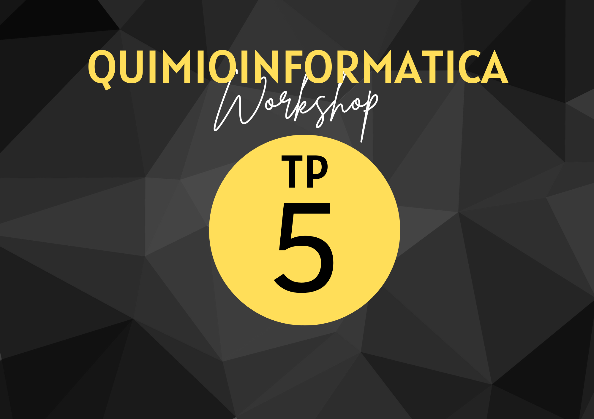

{ width="200", align="left" }

# **TP 5**
# Uso de Machine Learning en Quimioinformática { markdown data-toc-label = 'TP 5' }

[:fontawesome-solid-download: Colab Notebook](material/ML_Parte_1_VC.ipynb){ .md-button .md-button--primary }
[:fontawesome-solid-link: Colab Notebook](https://colab.research.google.com/drive/1kvBS68KwW1yqxVYXCubEnnTOper22wj-?usp=sharing){ .md-button .md-button--primary }

* Datos [:fontawesome-solid-download: esol.csv](material/esol.csv)
* Datos [:fontawesome-solid-download: BBB-dataset.csv](material/BBB-dataset.csv)
* Datos [:fontawesome-solid-download: enterovirus_unique.csv](material/enterovirus_unique.csv)
* Paper [:fontawesome-solid-download: PDF](material/Stokes(2020).pdf)

## Uso de Machine Learning en Quimioinformática

En esta clase introduciremos los pasos fundamentales del aprendizaje automático aplicado a problemas de quimioinformática. 

Veremos cómo seleccionar y preparar datos moleculares para entrenar modelos predictivos, cómo dividir correctamente los datos para evitar sobreajuste y evaluar el rendimiento del modelo, y cómo elegir un algoritmo adecuado según el tipo de tarea (clasificación o regresión) y las características del conjunto de datos. 