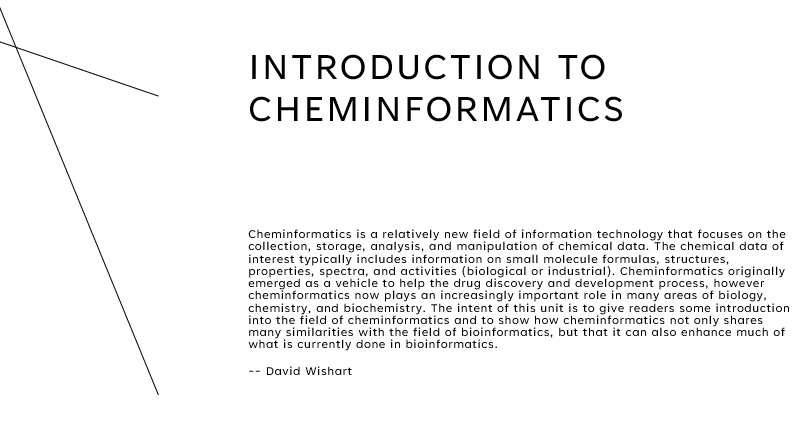

## Introducción a la Quimioinformática

{ width="850" }

:fontawesome-regular-file-pdf: [Slides](clase-1.pdf) 

<!--
 * :fontawesome-regular-file-pdf: [Slides](presentacionDeLaMateria-2022.pdf) 
 
 

## Conceptos elementales de computación y algoritmos

 * :fontawesome-regular-file-pdf: [Slides](IntroduccionComputacion2022.pdf) 
 
 

## Experimentos en bioinformática

 * :fontawesome-regular-file-pdf: [Slides](experimentosBioinformaticos2022.pdf) 
 
 

[//]: # ()
[//]: # (This is a comment on a new line.)
-->

## Material de lectura y consulta
 * :paperclip: Russo E. Chemistry plans a structural overhaul. Nature. 2002 419(6903):4-7. [doi: 10.1038/nj6903-04a](https://doi.org/10.1038/nj6903-04a). PMID: 12226620.
 * :paperclip: Nicholls A, McGaughey GB, Sheridan RP, Good AC, Warren G, Mathieu M, Muchmore SW, Brown SP, Grant JA, Haigh JA, Nevins N, Jain AN, Kelley B. Molecular shape and medicinal chemistry: a perspective. J Med Chem. 2010 53(10):3862-86. [doi: 10.1021/jm900818s](https://doi.org/10.1021/jm900818s). PMID: 20158188; PMCID: PMC2874267.
 * :octicons-book-16: Foye's Principles of Medicinal Chemistry (2008). T Lemke, DA Williams. ISBN: 9780781768795. Lippincott Williams & Wilkins; 6th edition
 * :octicons-book-16: Handbook of Chemoinformatics: From Data to Knowledge. Editor(s):Prof. Dr. Johann Gasteiger (2003). Print ISBN:9783527306800. Online ISBN:9783527618279. [DOI:10.1002/9783527618279](https://doi.org/10.1002/9783527618279). WILEY‐VCH Verlag GmbH 
 * :octicons-book-16: Introduction to Bioinformatics (2019), 4th Edition. Oxford University Press. Arthur M Lesk (hay dos copias en el lab). 

### Canonización de moléculas
 * :paperclip: Schneider N, Sayle RA, Landrum GA. Get Your Atoms in Order--An Open-Source Implementation of a Novel and Robust Molecular Canonicalization Algorithm. J Chem Inf Model. 2015 55(10):2111-20. [doi: 10.1021/acs.jcim.5b00543](https://doi.org/10.1021/acs.jcim.5b00543). PMID: 26441310.
 * :paperclip: Krotko DG. Atomic ring invariant and Modified CANON extended connectivity algorithm for symmetry perception in molecular graphs and rigorous canonicalization of SMILES. J Cheminform. 2020 12(1):48. [doi: 10.1186/s13321-020-00453-4](https://doi.org/10.1186/s13321-020-00453-4). PMID: 33431026; PMCID: PMC7439248.

### Bases de Datos y 
* Heller SR, McNaught A, Pletnev I, Stein S, Tchekhovskoi D. InChI, the IUPAC International Chemical Identifier. J Cheminform. 2015 May 30;7:23. doi: 10.1186/s13321-015-0068-4. PMID: 26136848; PMCID: PMC4486400.
* Hähnke VD, Kim S, Bolton EE. PubChem chemical structure standardization. J Cheminform. 2018 10(1):36. 
doi: 10.1186/s13321-018-0293-8. PMID: 30097821; PMCID: PMC6086778.

### Chemical space
* :paperclip: Reymond JL. Chemical space as a unifying theme for chemistry. J Cheminform. 2025 Jan 16;17(1):6. doi: 10.1186/s13321-025-00954-0. PMID: 39825400; PMCID: PMC11740331.
* :paperclip: Reymond JL. The chemical space project. Acc Chem Res. 2015 Mar 48(3):722-30. doi: 10.1021/ar500432k. PMID: 25687211.
* Mullard A. The drug-maker's guide to the galaxy. Nature. 2017 549(7673):445-447. doi: 10.1038/549445a. PMID: 28959982.
* :paperclip: Gorse, A.-D. (2006). Diversity in Medicinal Chemistry Space. Current Topics in Medicinal Chemistry, 6(1), 3–18. doi:10.2174/156802606775193310 
* :paperclip: Hoffmann T, Gastreich M. The next level in chemical space navigation: going far beyond enumerable compound libraries. Drug Discov Today. 2019 May;24(5):1148-1156. doi: 10.1016/j.drudis.2019.02.013. PMID: 30851414.

