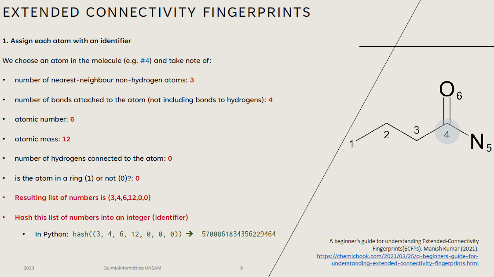

## Fingerprints, Propiedades y Ontologias

{ width="850" }

## Slides 

 * :fontawesome-regular-file-pdf: [Slides Clase Teórica 2](clase2-2025.pdf) 

## Pyton Notebooks

* :material-language-python: [fingerprints-a-mano](./fingerprints_a_mano.ipynb). **Notebook:** Como convertir información química en bitstrings, en python, a mano. 
* :material-language-python: [fingerprinting_with_rdkit](./fingerprinting_with_rdkit.ipynb). **Notebook:** Ejemplos de distintos tipos de fingerprints en rdkit, y como afectan los valores de similitud entre moléculas. 

## Material de lectura y consulta

   * :paperclip: O'Boyle NM, Banck M, James CA, Morley C, Vandermeersch T, Hutchison GR. Open Babel: An open chemical toolbox. J Cheminform. 2011 Oct 7;3:33. [DOI:10.1186/1758-2946-3-33](https://doi.org/10.1186/1758-2946-3-33). [PMID:21982300](https://pmid.us/21982300).
    * :paperclip: Hu Y, Stumpfe D, Bajorath J. Recent Advances in Scaffold Hopping. J Med Chem. 2017 Feb 23;60(4):1238-1246. [DOI:10.1021/acs.jmedchem.6b01437](https://doi.org/10.1021/acs.jmedchem.6b01437). Epub 2016 Dec 21. [PMID:28001064](https://pmid.us/28001064).
  * :paperclip: Mitternacht S. FreeSASA: An open source C library for solvent accessible surface area calculations. F1000Res. 2016 Feb 18;5:189. [DOI:10.12688/f1000research.7931.1](https://doi.org/10.12688/f1000research.7931.1). [PMID:26973785](https://pmid.us/26973785).
  * :paperclip: Bolcato G, Heid E, Boström J. On the Value of Using 3D Shape and Electrostatic Similarities in Deep Generative Methods. J Chem Inf Model. 2022 Mar 28;62(6):1388-1398. [DOI:10.1021/acs.jcim.1c01535](https://doi.org/10.1021/acs.jcim.1c01535). Epub 2022 Mar 10. [PMID:35271260](https://pmid.us/35271260).
  * :paperclip: Ertl P, Rohde B, Selzer P. Fast calculation of molecular polar surface area as a sum of fragment-based contributions and its application to the prediction of drug transport properties. J Med Chem. 2000 Oct 5;43(20):3714-7. [DOI:10.1021/jm000942e](https://doi.org/10.1021/jm000942e). [PMID:11020286](https://pmid.us/11020286).
  * :material-book-education: [ChEBI User Guide](https://docs.google.com/document/d/1_w-DwBdCCOh1gMeeP6yqGzcnkpbHYOa3AGSODe5epcg/edit) 
  * :simple-microdotblog: Manish Kumar (2021). [A beginner's guide for understanding Extended-Connectivity Fingerprints(ECFPs)](https://chemicbook.com/2021/03/25/a-beginners-guide-for-understanding-extended-connectivity-fingerprints.html)