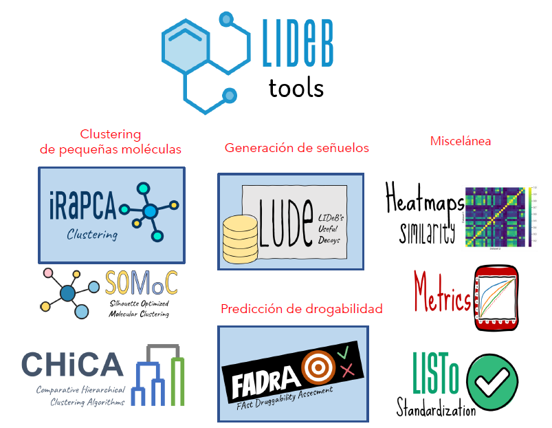

#### Algoritmos de clustering , métricas de validación y aplicaciones, y métricas de enriquecimiento, campañas de cribado retrospectivo y generación de señuelos

* :fontawesome-regular-file-pdf: [Slides](slides-charla-alan-talevi.pdf) 

{ width="550" }

## Material de lectura y consulta

  * :paperclip: The next level in chemical space navigation: going far beyond enumerable compound libraries. Hoffmann T, Gastreich M. (2019) Drug Discov Today. 24(5):1148-1156. [doi:10.1016/j.drudis.2019.02.013](https://10.1016/j.drudis.2019.02.013). PMID: 30851414.
  * :paperclip: LIDeB Tools: A Latin American resource of freely available, open-source cheminformatics apps. Prada DN, Alberca LN et al (2022) [Artificial Intelligence in the Life Sciences 2, 100049](https://doi.org/10.1016/j.ailsci.2022.100049)
  * :material-github: Código y software, [LIDeB Github repository](https://github.com/lideb)
  * :paperclip: Evaluating virtual screening methods: good and bad metrics for the "early recognition" problem. Truchon JF, Bayly CI. (2007) J Chem Inf Model. 47(2):488-508. [doi:10.1021/ci600426e](https://doi.org/10.1021/ci600426e). PMID: 17288412.
  * :paperclip: Protocols for bridging the peptide to nonpeptide gap in topological similarity searches. Sheridan RP, Singh SB, Fluder EM, Kearsley SK. (2001) J Chem Inf Comput Sci. 41(5):1395-406. [doi:10.1021/ci0100144](https://doi.org/10.1021/ci0100144). PMID: 11604041.
  * :paperclip: Directory of useful decoys, enhanced (DUD-E): better ligands and decoys for better benchmarking. Mysinger MM, Carchia M, Irwin JJ, Shoichet BK. (2012) J Med Chem. 55(14):6582-94. [doi:10.1021/jm300687e](https://doi.org/10.1021/jm300687e). PMID: 22716043; PMCID: PMC3405771.
  * :paperclip: Generating property-matched decoy molecules using deep learning. Imrie F, Bradley AR, Deane CM. (2021)  Bioinformatics 37(15):2134-2141. [doi:10.1093/bioinformatics/btab080](https://doi.org/10.1093/bioinformatics/btab080). PMID: 33532838; PMCID: PMC8352508.